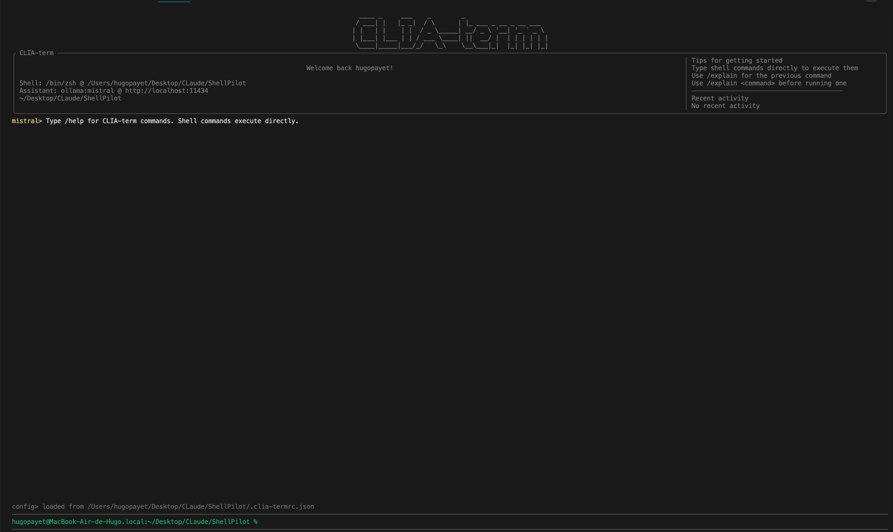
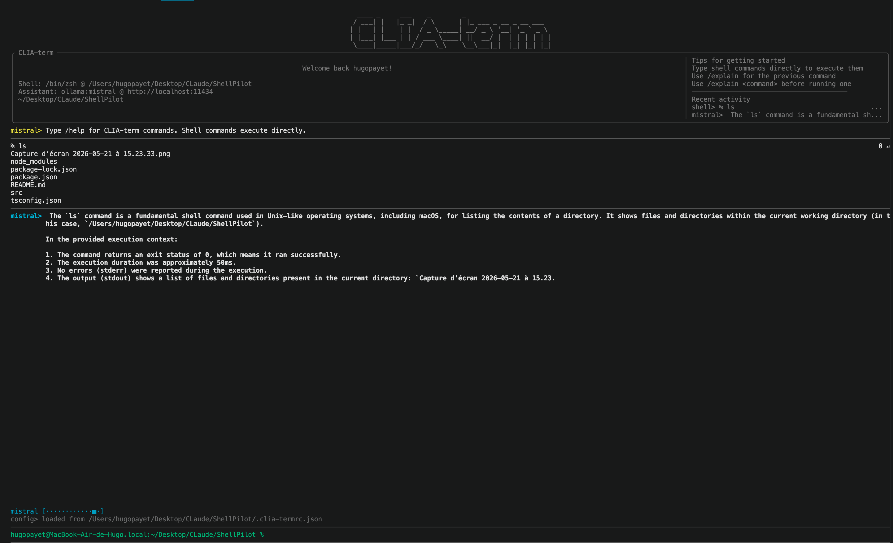
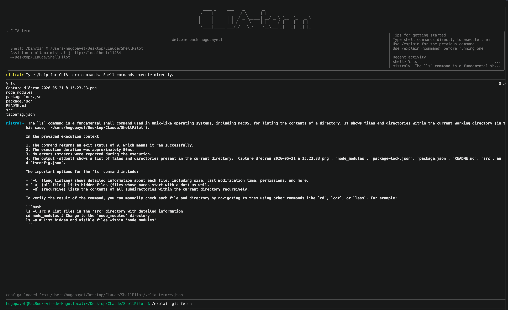

# CLIA-term

Interactive shell UI with explicit LLM-powered command explanations.

CLIA-term executes normal shell commands directly. Explanations are opt-in:

- `/explain`: explain the previous shell command.
- `/explain <command>`: explain a command without executing it.

## Requirements

- Node.js 20+
- Optional: Ollama running locally for explanations, or an OpenAI-compatible cloud endpoint

## Install

```bash
npm install
```

## Run

```bash
npm run start
```

## Demo







## CLI Help

```bash
npm run start -- --help
```

## Runtime Commands

- `/help`: show available internal commands
- `/explain [command]`: explain the previous shell command or a provided command
- `/whatami`: show the active AI provider and model
- `/status`: show shell and assistant provider status
- `/alias`: list configured command aliases
- `/clear`: clear transcript and reset conversation messages
- `/history [count]`: show latest session messages
- `/exit`: quit app
- `/quit`: alias for `/exit`

Any input that does not start with `/` is executed by the configured shell.

The interactive prompt uses a zsh-like shape: `user@host:cwd %`.

Assistant transcript labels and the generation indicator use the active model name, for example `mistral>`.

Shell transcript command lines show the command on the left and its exit code on the right, for example `% ls  0 ↵`.

When the input is empty, press `Up` to recall previous inputs and `Down` to move back toward the empty prompt. Suggestion navigation keeps priority while suggestions are visible.

Native terminal text selection is enabled by default. Use `PageUp`/`PageDown` to scroll through long output, and press `End` to jump back to the latest context. Press `Ctrl+G` to toggle mouse capture if you want CLIA-term to handle mouse-wheel scrolling; press it again to restore text selection.

## Example Session

```text
pwd
ls -la
/explain
/explain find . -name "*.ts" -maxdepth 2
/whatami
/status
```

`cd` is handled as a persistent shell working-directory change when used as a standalone command:

```text
cd src
pwd
cd -
```

## Assistant Providers

Default config uses Ollama:

```json
{
  "assistant": {
    "provider": "ollama",
    "model": "llama3.1",
    "baseUrl": "http://localhost:11434"
  }
}
```

For an OpenAI-compatible cloud provider:

```json
{
  "assistant": {
    "provider": "openai-compatible",
    "model": "gpt-4o-mini",
    "baseUrl": "https://api.openai.com/v1",
    "apiKeyEnv": "OPENAI_API_KEY"
  }
}
```

For local development without a model:

```json
{
  "assistant": {
    "provider": "mock"
  }
}
```

## Config File

Auto-discovered config files:

- `clia-term.config.json`
- `.clia-termrc.json`

Or explicit:

```bash
npm run start -- --config ./my-config.json
```

Example:

```json
{
  "assistant": {
    "provider": "ollama",
    "model": "llama3.1",
    "baseUrl": "http://localhost:11434"
  },
  "keybindings": {
    "suggestionNext": ["down"],
    "suggestionPrev": ["up"],
    "historyNext": ["down"],
    "historyPrev": ["up"],
    "toggleMouseCapture": ["ctrl+g"]
  },
  "aliases": {
    "commands": {
      "?": "help"
    },
    "keybindings": {
      "ctrl+c": "exit"
    }
  }
}
```

## Architecture

- `src/core/shell-runner.ts`: executes shell commands and handles persistent standalone `cd`
- `src/core/shell-history.ts`: keeps executed command history for `/explain`
- `src/core/explanation-service.ts`: isolates command explanation orchestration
- `src/providers/*`: swappable LLM providers for Ollama, OpenAI-compatible APIs, and mock development
- `src/core/command-registry.ts`: internal command routing
- `src/core/runtime-controller.ts`: coordinates shell execution, explanations, session state, and UI events
- `src/ui/app.tsx`: Ink rendering, input loop, suggestions, and scrolling
